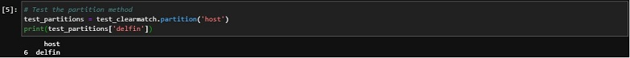

# clearmatch
Clearmatch is a package for matching records from one dataset to another by using a key, which has reference records. 
If the records to be matched to are synonyms of a reference record in the key that record is matched with its reference.
Clearmatch also makes it easy to see summary statistics and generate bar plots of missingness.

Dependencies: Matplotlib, Numpy, Pandas

Installation

 {width: 70%;
heigth: 70%}

Creating ClearMatch objects from DataFrames

 {width: 70%;
heigth: 70%}

Partitioning the host DataFrame based on unique values in a given column
  *Note that the resulting DataFrames are returned in a dictionary, so you should use the ['name'] convention to access the DataFrames
  
 {width: 70%;
height: 70%}

Defining the lookup structures for matching

 {width: 70%;
height: 70%}

Joining matches to the host DataFrame
  
 {width: 70%;
heigth: 70%}

Showing summary statistics

 {width: 70%;
heigth: 70%}

Visualizing missingness

 {width: 70%;
heigth: 70%}
